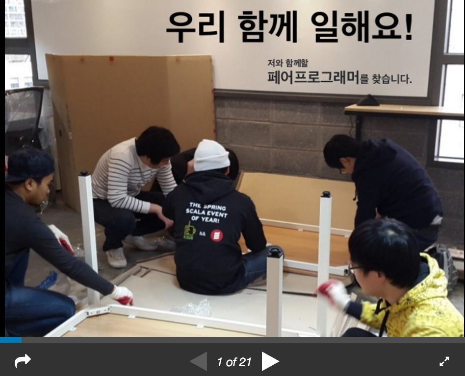

## Seungwoo Lee
>   
Hello. My name is Seungwoo Lee and I am a Software engineer.  

## contact
> asbubam@gmail.com  
https://blog.2dal.com  
https://www.facebook.com/asbubam

## I love Node.js Programming.
> *Speaker about "Node.js programming"*  
> @ [**playnode 2015**](http://playnode.io)  
> @ [**W3C HTML5 Conference 2015**](http://onoffmix.com/event/58200)  

> 

## Skill Sets
>###### Node.js, Ruby, Java, C
###### PostgreSQL, MySQL, Oracle, MongoDB
###### Redis, RabbitMQ
###### Express, Rails
###### Amazon AWS, Docker, Terraform
###### Vim, Git

## Experience
##### Woowa.Bros. (Sep 2018 - )
> Working at SRE Team

##### Coupang (Jan 2018 - Aug 2018)
> Worked at Continuous Deployment Platform Team
Develop deployment platform
*AWS, Java, Spring, Python*

##### SMARTSTUDY (May 2017 - Dec 2017)
> Worked at SRE Team  
Develop graphQL API  
AWS Resource Terraforming  
Design AWS VPC Network  
*AWS, Terraform, Node.js*

#### Coupang (Nov 2016 - Apr 2017)
> Worked at Core Framework Platform Team  
Develop Jenkins Batch Plugin  
Setup Jenkins Batch Container for Multiple Teams  
*AWS, Java, Memcached, Jenkins*  

##### Flitto (May 2013 – Oct 2016)
> Develop [Flitto](https://www.flitto.com) Web, API Server  
Develop B2B Mass Translation Service  
*AWS, Node.js, PostgreSQL, Redis, MongoDB, RabbitMQ, Nginx*  

##### News1 (May 2012 – May 2013) 
> Develop [news1](http://www.news1.kr) Web, API Server  
Develop news1 news desk on the web.  
Develop news1 iphone mobile app  
*Ruby, Ruby on Rails, Objecive-C, Node.js, MySQL, Memcached, Nginx*  

##### UNUS (May 2011 – May 2012)
> Develop [dingdong](http://www.dingdongmall.co.kr) API server  
Develop Public Transportation API Server  
*Struts2, Spring3, Oracle Database*  

##### Asadal (December 2005 – November 2008 )
> Develop Domain Registration (.com, .net, org, .kr ...) Server  
Develop Big File Transfer Server  
Develop Hosting Server Monitoring System  
*Java, C, MySQL, Apache*  

##### Good Software Lab (August 2004 – November 2005)
> LG 3G Network Monitoring System  
ETRI SmartTV  
*Java, AWT/Swing UI, C language, JNI, kaffe VM*  

##### TEAMMAY (November 2002 – June 2003)
> Develop (MMORPG/casual online) game server  
*C language*  

## Education
> ##### Tokyo Visual Arts - Fashion Photography  
##### The Naganuma Tokyo Japanese School (東京日本語学校)

## Recommendations
\- ***정아영 (전 Flitto PR Team)***
> 버프소년!! 주변 사람들에게 힘을 불어넣고 버프를 주며 데미지는 줄여줍니다.  

\- ***이혜원 (전 Flitto Design Team)***
> 승우님은 제가 보아온 개발자분들 중에 가장 신나게 개발하시는 분이세요.  
같이 일하면서 가장 큰 배운 점이 있다면, 주인의식을 가지고 일해야 신날 수 있다는 점이었어요.  
주인의식 덕분에 피드백을 통해 수정에 들어가도 불평 없이 신나게 할 수 있다는 점을 알았어요.  
다 내 것 잘 되자고 하는 일이니깐 뭐든 신날 수 있던 거예요 :)  
그래서 언제 어디서든 서비스를 생각하는 것조차 신나는 일이 될 수 있다는 것도 알았어요!  
같이 일하면서, 좋은 팀원을 만나게 되어서 큰 기쁨이었습니다!  
꼭 제가 직원을 채용하는 ceo가 된다면 1등으로 컨택 드리고 싶어요! (진심)  

\- ***이연목 (Flitto Marketing Team)***
> 부드러운 카리스마란 무엇인지를 몸소 보여주는 표본.  
소리 지르지 않고도, 인상 쓰지 않고도, 조직에 긍정적이고 유의미한 변화를 불러오는 당신의 시크릿은 마법인가요?  
누가 개발자는 자기 모니터의 세계에만 갇혀 있다 했던가.  
개발팀뿐 아니라 모든 팀원이 기꺼이, 즐겁게, 신나게 일하기를 꿈꾸는 당신.  
가슴속의 '불가능한' 꿈을 결국 현실로 만들어내는 리얼리스트 승우님을 언제나 응원한다. 

\- ***김주용 (Flitto B2B Team)***
> 제가 개발자가 아닌지라 실력을 말할 수는 없지만 따뜻한 리더쉽을 가진 사람이라고 생각합니다.  
이는 곧 타 부서와의 협업에 능함을 이야기합니다.  
승우님과 같은 개발자는 타고나야 되지 않을까요?  

\- ***최호림 (Flitto Finance/Accounting)***
> 제가 본 개발자 중 가장 성실하고 마음 따뜻한 개발자 승우님!  
어느 회사건 영입 1순위 인재임을 간증(?) 합니다

\- ***서영욱 (Flitto B2B Team)***
> I had the pleasure of working with SeungWoo at Flitto as a business developer.  
We have worked together on several different projects teams.  

> It's very rare that you get to work with a kind and talented individual as Seungwoo.  
As a team-lead, Seungwoo lead his team with passion and truly cared for every member under his management.  
Thanks to his outstanding communication skills and his consideration for others, Seungwoo was very pleasant to work with under any circumstances.  
What I found most unique about working with Seungwoo was that, whenever he consulted me prior to requesting for any development, he really tried to understand my needs and took an approach that would provide the most benefits for the service, its users, and its employees.

> Seungwoo would be of greatly valued asset to any team.  

> 플리토에서 이승우 개발팀장님과 함께 일 할 기회가 있었습니다.  
Business Developer로서 승우님과 여러 프로젝트 팀에서 협업도 함께 진행하였습니다.  

> 팀장으로서 항상 주위사람들을 세심하게 배려하시고 협업에 있어서 승우님만큼 같이 일하기좋은 개발자는 없었습니다.  
개발니즈가 있거나 프로젝트가 진행에 앞서 상담을 할 때면 동료로서 같이 고민해주시고, 항상 개발에 앞서 어떻게해야 서비스와 유저에게 제일 도움이 되는지를 먼저 생각하시는 분이셨습니다.  

> 어느 기업이든 망설임없이 이승우 개발자님을 추천해드립니다.  

\- ***김케빈 (Flitto Software Engineer Team)***
> 스타트업 초기 플리토에서 지금까지 3년 동안 제 커리어에서 가장 큰 영향을 준 멘토 같은 엔지니어입니다.  
그는 훌륭한 기술력과 리더쉽 그리고 뛰어난 문제 해결 능력을 지닌 사람이기도 합니다.  
또한 동료를 이해하고 배려하며 주위에 있는 사람들을 즐겁게 일할 수 있도록 돕는 팀장님입니다.  
마지막으로 제가 개발할 수 있는 기간 동안 함께 일하고 싶은 엔지니어입니다.  

\- ***Thiebaut maeva (전 Flitto France Regional Specialist)***
> I had the pleasure to work Seungwoo at Flitto, even though we worked in different team i had the chance to work with him on different projects and i not only noticed how talented he was as developer but also how organised he was while working. Moreover, Seungwoo has a strong leadership and knows how to get the best out of his team.  
It was a real pleasure working with him.  
It is rare to find developers with such consideration and understanding for other.  
I truly think Seungwoo would be a strong asset for every company he work for.  

\- ***박광근 (Head of Flitto B2B Team)***
> 회사에서 이상적인 구성원은 퍼포먼스를 보여주면서 팀워크를 살릴 수 있는 사람이다.  
2년 반동안 친구가 아닌 가까이 지낸 동료로서 바라보는 이승우님은 위 2가지를 고루 섞은 사람이다.  
단지 책임감을 가지고 데드라인에 맞춰 최대한의 퍼포먼스를 보여주는 데 그치지 않는다.  
보이지 않게 진행이 더딘 팀원에게 도움과 마음을 준 것이 내 눈에 몇 번이나 적발되었다.  
그렇게 자기와 동료, 그리고 회사에 힘을 불어 일으키는 존재이기에 팀워크에 큰 영향을 주는 사람이다.  
많은 이들이 이해하는 축구에 비유하자면, 퍼포먼스에 가치를 둬 자신을 부각시키는 '호날두' 스타일이 아니라 '사비' 처럼 어시스트와 리딩을 동시에 할 수 있는 윤활유 같은 사람이다.  

\- ***부시종 (전 Flitto PM)***
> 승우님과는 2014~2016 약 2년간 플리토에서 함께 일했었습니다.   

> 승우님과 일하는 2년 동안 플리토는 적은 인원으로 놀라운 발전을 이루었는데, 승우님은 그 중 핵심 구성원으로서의 기여도도 당연히 높지만, 이에 더해 모두가 함께 힘을 합쳐 나아갈 수 있도록 마음을 모으는 데 절대적인 기여를 했습니다.   

> 이에 대해 좀 더 자세히 나누어 추천의 사유를 나열해 보겠습니다.  

> 1. 에너지와 열정  
 얼핏 보기엔 조용하지만 엄청난 에너지와 열정을 가지고 있습니다. 함께 일하는 동료라면 누구나 항상 승우님의 에너지와 열정을 느낄 수 있으며, 저 스스로도 그리고 제가 보아온 많은 다른 동료들도 승우님의 에너지와 열정에 항상 많은 자극을 받았습니다.   

> 2. 긍정과 헌신  
 힘들고 어려운 상황에서도 언제나 이만큼의 노력과 고생이 가져올 결과와 보람을 생각하며 긍정적인 웃음을 잃지 않습니다. 더불어 상황이 힘들다고 당장의 미션을 처리하는 데에만 급급해하지 않고, 현재의 방법과 방향에 대해 계속 고민하며 더 좋은 결과를 위해 헌신합니다. 승우님의 이런 모습이 함께 일하는 동료의 마음에 불만과 원망 대신 의욕넘치는 파이팅이 솟아오르도록 영향을 미치는 것을 많이 볼 수 있었습니다.  
> 3. 깊은 고민과 신중함  
 에너지가 넘치고 긍정적인 사람은 대개 깊이 고민하기보단 급하고 충동적이기 쉽지만, 승우님의 강점은 긍정적이고 열정적이면서도 서두르지 않고 찬찬히 깊이 고민하고 신중히 이야기한다는 데 있습니다. 항상 지금의 방식보다 더 좋은 방식은 없을지 고민하고, 자신의 생각이 동료에게 어떤 영향을 줄 것인지를 따져 최선의 방식과 타이밍에 신중하게 의견을 내놓습니다.   

> 4. 공감력과 솔선수범  
 동료의 고민에서 조직의 문제까지 넓은 영역에 있어 다양한 입장과 관점을 이해하고 공감할 수 있는 포용력을 가지고 있습니다. 뿐만 아니라 이를 극복하기 위해 본인이 무엇을 도울 수 있을까를 고민하고 이를 바로 실천하는 행동력도 가지고 있습니다.   

> 5. 책임감과 신뢰  
지금까진 승우님의 개발자의 측면보다는 동료의 측면에서의 강점을 더 많이 이야기했지만, 개발자로서의 승우님은 언제나 자신의 작업에 대해 강한 책임감을 보여왔으며 이에 신뢰할 수 있는 사람이었습니다.  

> 6. 꾸준한 제안  
 승우님과 일하다보면 조용한 모습에도 불구하고 많은 제안을 하는 모습을 볼 수 있습니다. 서비스적인 제안부터 업무 방법론적인 제안까지 넓은 영역의 다양한 제안을 하는데, 그 하나하나는 애정/열정과 고민이 녹아있어 가볍지 않고 깊이가 있습니다. 그러나 여러 이유로 본인의 제안이 받아들여지지 않는다해도 그로 인해 실망하거나 부정적인 에너지를 내보이기보다는 그런 상황에 공감하고 그 이유를 고려한 더 좋은 아이디어로 발전시키고자 하는 열정과 애정을 보여줍니다.  
승우님과 함께하면 누구나 항상 자극을 받고 에너지가 채워집니다.   

> 요컨대, 본인의 역할을 100%해내는 데 그치지 않고 주위 동료까지 100%를 할 수 있게 만드는 슈퍼히어로라고 할 수 있을 것입니다. 

\- ***이소은 (Flitto Front-end Developer)***
> 승우님은 따뜻한 카리스마를 가진 리더이자 제가 존경하는 개발자입니다. 주니어 개발자의 역량을 최대한 끌어 올릴 수 있도록 
동기부여 해 주시고 어려운 문제에 직면 했을때 함께 해결해 나가는 훌륭한 시니어 개발자 입니다. 보통 이상적인 개발자 문화를 LESS(Learn,Enjoy,Solve,Share)라고 하는데, 팀원들과 함께 기술을 배우고, 함께 즐기고, 함께 해결하고, 경험을 공유하는 개발자 문화를 만들기 위해 노력하시고, 또한 Flitto에서 이러한 문화를 실천하시고 계십니다. 주니어 개발자 입장에서 배울 점이 많고, 닮고 싶은 개발자입니다. 

\- ***이재근 (전 Flitto Software Engineer)***
> 제가 본 승우님은 성장에 대해 끊임 없이 질문하고 팀원들과 함께 좋은 개발자가 되기 위해 고민하는 사람입니다. 다른 사람과 함께 가기 위해 본인이 속도를 늦출줄 알며 동료의 경력에 상관없이 항상 배우는 자세를 견지하고 있습니다. 승우님을 표현한다면 노드개발자, 백엔드 혹은 서버개발자라고 하기보단 서비스 개발자라고 칭하고 싶습니다. 서비스 목적, 상황, 환경 그리고 사람까지 고려하여 좋은 서비스를 만들고자 하는 열정과 능력을 가졌습니다. 저역시 승우님을 통해 많이 배웠고 앞으로도 같이 배워나가기를 희망합니다

\- ***변정훈 (aka Outsider)***
> 제가 그래서인지 자신만만한 사람보다는 부족함이 많은 것 같아서 고민도 많고 걱정도 많지만 부족함을 메꾸기 위해서 꾸준하게 노력하는 사람을 좋아합니다. 제가 아는 승우님은 이런 유형의 사람입니다. 개발을 좋아해서 항상 즐겁게 열심히 일해서 잘하는 것처럼 보이지만 그 가운데서 부족한 부분을 생각해서 더 좋게 해보려는 모습에 항상 자극을 받곤 합니다. 같이 일해 본 적은 없지만 승우님하고 같이 있으면 새로운 일이나 도전을 하면서 느끼는 두근거림이 저한테까지 전달되는 느낌이라 같이 일을 하면 얼마나 즐거울까 하는 생각을 많이 하게 됩니다.

\- ***승서영 (Flitto Designer)***
> 승우님은   
언제나 자세를 낮춰 들어주시고 많은 용기를 북돋아 주시는 플리토의 포근하고 따뜻한 ‘엄마’같은 존재이십니다.  
또한 서비스의 발전을 위해 항상 힘써주시며 뛰어난 개발 실력을 갖추신 엔지니어이십니다.   
때로는 한 발짝 뒤로 물러서서 냉정하게 다른 시선으로 바라볼 줄 알며 더 좋은 제안들과 방향을 제시해주시는 승우님이십니다. 승우님과 같이 협업하는 그 자체가 저에겐 행운입니다.   
끊임없는 열정과 패기를 가지신 승우님을 항상 응원합니다.  

\- ***장종호 (Flitto CS/QA/Everything)***
> 회사와 동료들의 꿈에 관심을 갖고 진심으로 응원해주는 사람. 승우님은 가끔 추상적이고 멀게만 느껴지는 '꿈'을 저의 코 앞에 현실감있게 가져다주셔서 온화한 말투에도 뜨끔뜨끔 놀라곤 합니다. 계속 함께한다면 꿈이 현실이 되고 현실을 넘어 꿈을 이룰 수 있을 것입니다. (덧붙여서 아마 당신의 퇴사 또한 누구보다 진심으로 응원해줄 그런 사람입니다.)

\-***박혜진 (Flitto CS 대장님)***
> 이승우님은 제가 처음 들어온 날부터 따듯하게 대해주신 정말 감사한 분입니다. 비록 같은 개발팀은 아니지만 CS/Operation을 하면서 승우님에게 배울 점이 많았습니다. 서비스에 대해 꾀뚫고 계셨고 유저분들의 피드백이 들어오면 함께 고민해주십니다. 또 어떻게 하면 더 수월하게 업무 진행을 할 수 있을지 제안도 많이 주셨습니다. 유저 피드백 작업을 진행하면서 개발 업무량/상황에 관련해서 불편없이 여쭤볼 수 있었고, 그래서 또 너무 많은 걸 여쭤보아 죄송한 마음도 있습니다. 분명 화나는 일도 있으실텐데 논리적으로 그리고 항상 차분하게 대해주셔서 정말 감사드립니다 ㅠ_ㅠ.

> 한마디로 함께 있으면 긍정 에너지를 내뿜는 그런 분입니다 :)!  

\-***성열우 (Flitto Software Enginner)***
> 저는 승우님과 같은 팀에서 그리고 바로 옆에서 같이 일해 본 행운아입니다. 그는 자신보다 동료를 더 생각하는 아주 인격적인 리더입니다. 승우님은 업무뿐만 아니라 팀원의 생활 전부를 존중하고 관심을 갖습니다. 또한 승우님은 주변 팀원들의 잠재력을 끌어올리는 리더입니다. 그와 함께 있을 때는 어떤 일을 진행하든 가능하다고 생각되어지고 자신감이 생기고 재밌어집니다. 이런 에너지가 일이 즐거워질 수 있도록 해줍니다. 마음 같아서는 항상 제 옆에 계셨으면 좋겠습니다. 만약 당신이 이런 승우님과 함께 일을 하고 있다면 정말 큰 행운을 갖고 계신 것이라고 말씀드리고 싶습니다. :)
 
## want more?
> *resume on slideshare (Korean)*   

> *resume on slideshare (Japanese)*  

> *Do you want work with me?*  

> *Docker 101 - slides*  

> *Docker 101 - youtube video*  
  
