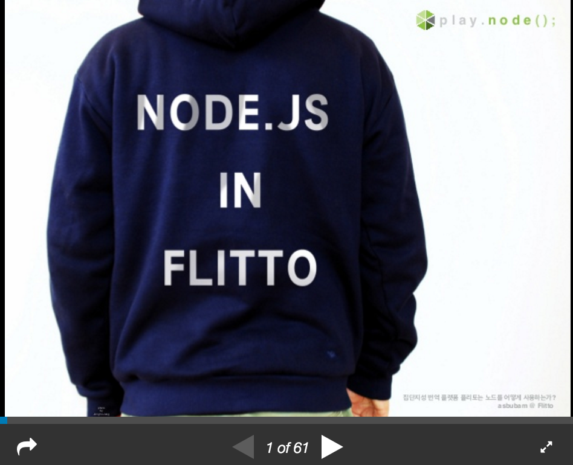

## Seungwoo Lee
> Hello. My name is Seungwoo Lee and I am a Software engineer.  
I'm making **Crowdsourcing Translation Platform Service** at [**Flitto**](https://www.flitto.com) using Node.js now.

## contact
> [asbubam@gmail.com](asbubam@gmail.com)  
https://www.facebook.com/asbubam

## I love Node.js Programming.
> *Speaker about "Node.js programming"*  
> [**playnode 2015**](http://playnode.io)  
> [**W3C HTML5 Conference 2015**](http://onoffmix.com/event/58200)  

> 

## Experience
##### Flitto (May 2013 – Present)
> Develop [Flitto](https://www.flitto.com) Web, API Server  
Develop B2B Mass translation service  
*AWS, Node.js, PostgreSQL, Redis, MongoDB, RabbitMQ, Nginx*  

##### News1 (May 2012 – May 2013 ) 
> Develop [news1](http://www.news1.kr) Web, API Server  
Develop news1 news desk on the web.  
Develop news1 iphone mobile app  
*Ruby, Ruby on Rails, Objecive-C, Node.js, MySQL, Memcached, Nginx*  

##### UNUS (May 2011 – May 2012)
> Develop [dingdong](http://www.dingdongmall.co.kr) API server  
Develop Public Transportation API Server  
*Structs2, Spring3, Oracle Database*  

##### Asadal (December 2005 – November 2008 )
> Develop Domain Registration (.com, .net, org, .kr ...) Server  
Develop Big File Transfer Server  
Develop Hosting Server Monitoring System  
*Java, C, MySQL, Apache*  

##### Good Software Lab (August 2004 – November 2005)
> LG 3G Network Monitoring System  
ETRI SmartTV  
*Java, AWT/Swing UI, C language, JNI, kaffe VM*  

##### TEAMMAY (November 2002 – June 2003)
> Develop (MMORPG/casual online) game server  
*C language*  

## Education
> ##### Tokyo Visual Arts - Fashion Photography  
##### The Naganuma Tokyo Japanese School (東京日本語学校)

## Recommendations
\- ***정아영 (전 Flitto PR Team)***
> 버프소년!! 주변 사람들에게 힘을 불어넣고 버프를 주며 데미지는 줄여줍니다.  

\- ***이혜원 (전 Flitto Design Team)***
> 승우님은 제가 보아온 개발자분들 중에 가장 신나게 개발하시는 분이세요.  
같이 일하면서 가장 큰 배운 점이 있다면, 주인의식을 가지고 일해야 신날 수 있다는 점이었어요.  
주인의식 덕분에 피드백을 통해 수정에 들어가도 불평 없이 신나게 할 수 있다는 점을 알았어요.  
다 내 것 잘 되자고 하는 일이니깐 뭐든 신날 수 있던 거예요 :)  
그래서 언제 어디서든 서비스를 생각하는 것조차 신나는 일이 될 수 있다는 것도 알았어요!  
같이 일하면서, 좋은 팀원을 만나게 되어서 큰 기쁨이었습니다!  
꼭 제가 직원을 채용하는 ceo가 된다면 1등으로 컨택 드리고 싶어요! (진심)  

\- ***이연목 (Flitto Marketing Team)***
> 부드러운 카리스마란 무엇인지를 몸소 보여주는 표본.  
소리 지르지 않고도, 인상 쓰지 않고도, 조직에 긍정적이고 유의미한 변화를 불러오는 당신의 시크릿은 마법인가요?  
누가 개발자는 자기 모니터의 세계에만 갇혀 있다 했던가.  
개발팀뿐 아니라 모든 팀원이 기꺼이, 즐겁게, 신나게 일하기를 꿈꾸는 당신.  
가슴속의 '불가능한' 꿈을 결국 현실로 만들어내는 리얼리스트 승우님을 언제나 응원한다. 

\- ***김주용 (Flitto B2B Team)***
> 제가 개발자가 아닌지라 실력을 말할 수는 없지만 따뜻한 리더쉽을 가진 사람이라고 생각합니다.  
이는 곧 타 부서와의 협업에 능함을 이야기합니다.  
승우님과 같은 개발자는 타고나야 되지 않을까요?  

\- ***최호림 (Flitto Finance/Accounting)***
> 제가 본 개발자 중 가장 성실하고 마음 따뜻한 개발자 승우님!  
어느 회사건 영입 1순위 인재임을 간증(?) 합니다

\- ***서영욱 (Flitto B2B Team)***
> I had the pleasure of working with SeungWoo at Flitto as a business developer.  
We have worked together on several different projects teams.  

> It's very rare that you get to work with a kind and talented individual as Seungwoo.  
As a team-lead, Seungwoo lead his team with passion and truly cared for every member under his management.  
Thanks to his outstanding communication skills and his consideration for others, Seungwoo was very pleasant to work with under any circumstances.  
What I found most unique about working with Seungwoo was that, whenever he consulted me prior to requesting for any development, he really tried to understand my needs and took an approach that would provide the most benefits for the service, its users, and its employees.

> Seungwoo would be of greatly valued asset to any team.  

> 플리토에서 이승우 개발팀장님과 함께 일 할 기회가 있었습니다.  
Business Developer로서 승우님과 여러 프로젝트 팀에서 협업도 함께 진행하였습니다.  

> 팀장으로서 항상 주위사람들을 세심하게 배려하시고 협업에 있어서 승우님만큼 같이 일하기좋은 개발자는 없었습니다.  
개발니즈가 있거나 프로젝트가 진행에 앞서 상담을 할 때면 동료로서 같이 고민해주시고, 항상 개발에 앞서 어떻게해야 서비스와 유저에게 제일 도움이 되는지를 먼저 생각하시는 분이셨습니다.  

> 어느 기업이든 망설임없이 이승우 개발자님을 추천해드립니다.  

\- ***김케빈 (Flitto Software Engineer Team)***
> 스타트업 초기 플리토에서 지금까지 3년 동안 제 커리어에서 가장 큰 영향을 준 멘토 같은 엔지니어입니다.  
그는 훌륭한 기술력과 리더쉽 그리고 뛰어난 문제 해결 능력을 지닌 사람이기도 합니다.  
또한 동료를 이해하고 배려하며 주위에 있는 사람들을 즐겁게 일할 수 있도록 돕는 팀장님입니다.  
마지막으로 제가 개발할 수 있는 기간 동안 함께 일하고 싶은 엔지니어입니다.  

\- ***Thiebaut maeva (전 Flitto France Regional Specialist)***
> I had the pleasure to work Seungwoo at Flitto, even though we worked in different team i had the chance to work with him on different projects and i not only noticed how talented he was as developer but also how organised he was while working. Moreover, Seungwoo has a strong leadership and knows how to get the best out of his team.  
It was a real pleasure working with him.  
It is rare to find developers with such consideration and understanding for other.  
I truly think Seungwoo would be a strong asset for every company he work for.  

\- ***박광근 (Head of Flitto B2B Team)***
> 회사에서 이상적인 구성원은 퍼포먼스를 보여주면서 팀워크를 살릴 수 있는 사람이다.  
2년 반동안 친구가 아닌 가까이 지낸 동료로서 바라보는 이승우님은 위 2가지를 고루 섞은 사람이다.  
단지 책임감을 가지고 데드라인에 맞춰 최대한의 퍼포먼스를 보여주는 데 그치지 않는다.  
보이지 않게 진행이 더딘 팀원에게 도움과 마음을 준 것이 내 눈에 몇 번이나 적발되었다.  
그렇게 자기와 동료, 그리고 회사에 힘을 불어 일으키는 존재이기에 팀워크에 큰 영향을 주는 사람이다.  
많은 이들이 이해하는 축구에 비유하자면, 퍼포먼스에 가치를 둬 자신을 부각시키는 '호날두' 스타일이 아니라 '사비' 처럼 어시스트와 리딩을 동시에 할 수 있는 윤활유 같은 사람이다.  

\- ***부시종 (전 Flitto PM)***
> 언제나 믿을 수 있고 모두에게 에너지를 불어넣어주는 사람. 

## want more?
> **resume on slideshare(Korean)**
> 

> **resume on slideshare(Japanese)**
> 

> **Do you want work with me?**
> 

## contact
> [asbubam@gmail.com](asbubam@gmail.com)  
https://www.facebook.com/asbubam
